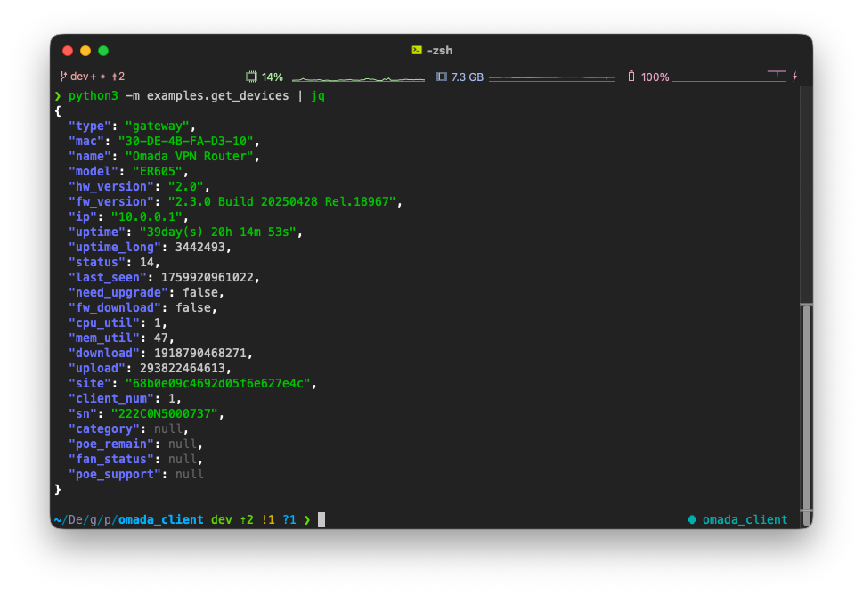

# omada-client

> Python client for **Tp-Link Omada Controller** ([Omada Software Controller](https://www.tp-link.com/business-networking/omada-sdn-controller/omada-software-controller/)). Allows executing API calls to the Omada Controller from Python code.

[](https://pypi.org/project/omada-client)
[](https://pypi.org/project/omada-client)
[](https://pypi.org/project/omada-client)



Library created for automating and integrating with TP-Link Omada SDN Controllers. Unlike raw HTTP scripts or outdated wrappers, this library provides a clean, typed interface that enables developers and network engineers to manage Omada infrastructure with minimal effort and maximum reliability.

It abstracts away authentication, session handling, and endpoint routing, allowing you to focus on logic instead of network plumbing. The library is fully compatible with modern Python environments (>=3.11), supports structured data models via Pydantic, and includes utilities for batching large requests, safely manipulating network routes, and managing connected devices.


## Methods Reference

### WAN `omada.wan.*`
- `get_info_all()` - Internet data info 
- `get_info_by_name()` - Get WAN port by name
- `get_info_by_description()` - Get WAN port by description

### WLAN `omada.wlan.*`
- `get_list()` - List all Wi-Fi networks
- `get_ssids()` - List all SSID info
- `get_ssid_by_id()` - Get Wi-Fi network by ID

### Routing `omada.routing.*`
- `create_static_route()` - Create a single static route
- `bulk_create_static_routes()` - Create static routes from large data
- `get_static_route_list()` - List all routes
- `get_static_route_by_name()` - Get route by name
- `find_static_routes_by_name()` - Find routes by name

### Devices `omada.device.*`
- `get_devices()` - List all devices

### Clients `omada.client.*`
- `get_list()` - List all clients
- `get_info_by_mac()` - Get client by MAC
- `get_by_ip()` - Get client by IP
- `set_ip_settings()` - Set ip setting for client
- `disconnect()` - Disconnect client
- `block()` - Block client
- `unblock()` - Unblock client

### Site `omada.site.*`
- `get_list()` - List all sites
- `get_info()` - Get site by ID

### Profile `omada.profile.*`
- `get_all_group()` - List all groups
- `get_group_by_id()` - Get group by ID
- `get_group_by_name()` - Get group by name

## Installation
Using python:
```sh
pip install omada-client
```


## Quick Start
Using direct credentials

```python
from omada_client import OmadaClient

omada = OmadaClient(
    "OMADA_DOMAIN",
    "OMADACID",
    "CLIENT_ID",
    "CLIENT_SECRET"
)
```

Using environment variables

```python
from dotenv import load_dotenv
import os
from omada_client import OmadaClient

load_dotenv()

omada = OmadaClient(
    os.getenv("OMADA_DOMAIN"),
    os.getenv("OMADACID"),
    os.getenv("CLIENT_ID"),
    os.getenv("CLIENT_SECRET")
)

omada.setting.set_site("xxxxxxxxxxxxxxxxxxxxxxxx")

print(omada.device.get_devices())
```

## Notes
- Replace all IPs, MAC addresses, and credentials with real values.  
- Environment variables help keep sensitive credentials out of code.  
- Use badges above to quickly check test status and PyPI version.
